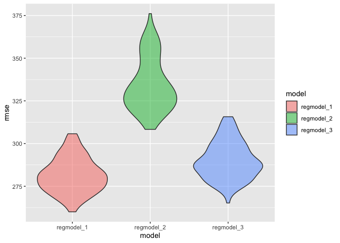

p8105\_hw6\_bg2645
================
Bing Bing Guo
11/20/2019

## Question 1

**Load and clean the data for regression analysis**

``` r
birthweight_data = 
  read_csv("./data/birthweight.csv") %>% 
  janitor::clean_names()  %>% 
mutate(babysex = recode(babysex, "1" = "male", "2" = "female"),
       frace = recode(frace, "1" = "white", "2" = "black", "3" = "Asian", "4" =
                      "Puerto Rican", "8" = "other", "9" = "unknown"), 
       mrace = recode(mrace, "1" = "white", "2" = "black", "3" = "asian", "4" =
                      "Puerto Rican", "8" = "Other"), 
       malform = recode(malform,"0" = "absent", "1" = "present")) 
```

    ## Parsed with column specification:
    ## cols(
    ##   .default = col_double()
    ## )

    ## See spec(...) for full column specifications.

``` r
birthweight_data
```

    ## # A tibble: 4,342 x 20
    ##    babysex bhead blength   bwt delwt fincome frace gaweeks malform menarche
    ##    <chr>   <dbl>   <dbl> <dbl> <dbl>   <dbl> <chr>   <dbl> <chr>      <dbl>
    ##  1 female     34      51  3629   177      35 white    39.9 absent        13
    ##  2 male       34      48  3062   156      65 black    25.9 absent        14
    ##  3 female     36      50  3345   148      85 white    39.9 absent        12
    ##  4 male       34      52  3062   157      55 white    40   absent        14
    ##  5 female     34      52  3374   156       5 white    41.6 absent        13
    ##  6 male       33      52  3374   129      55 white    40.7 absent        12
    ##  7 female     33      46  2523   126      96 black    40.3 absent        14
    ##  8 female     33      49  2778   140       5 white    37.4 absent        12
    ##  9 male       36      52  3515   146      85 white    40.3 absent        11
    ## 10 male       33      50  3459   169      75 black    40.7 absent        12
    ## # … with 4,332 more rows, and 10 more variables: mheight <dbl>,
    ## #   momage <dbl>, mrace <chr>, parity <dbl>, pnumlbw <dbl>, pnumsga <dbl>,
    ## #   ppbmi <dbl>, ppwt <dbl>, smoken <dbl>, wtgain <dbl>

``` r
sum(!complete.cases(birthweight_data))
```

    ## [1] 0

  - There are no missing values in the dataset.

**Propose a regression model for birthweight and show a plot of model
residuals against fitted
values**

``` r
regmodel_1 = lm(bwt ~ fincome + gaweeks + delwt + bhead +blength + smoken, data = birthweight_data) 
regmodel_1 %>% 
summary()
```

    ## 
    ## Call:
    ## lm(formula = bwt ~ fincome + gaweeks + delwt + bhead + blength + 
    ##     smoken, data = birthweight_data)
    ## 
    ## Residuals:
    ##     Min      1Q  Median      3Q     Max 
    ## -1180.2  -184.1    -8.4   178.2  2514.7 
    ## 
    ## Coefficients:
    ##               Estimate Std. Error t value Pr(>|t|)    
    ## (Intercept) -6185.0498    94.9858 -65.115  < 2e-16 ***
    ## fincome         1.2509     0.1659   7.538 5.79e-14 ***
    ## gaweeks        13.8723     1.4860   9.335  < 2e-16 ***
    ## delwt           2.0874     0.1983  10.526  < 2e-16 ***
    ## bhead         133.4445     3.4853  38.287  < 2e-16 ***
    ## blength        78.6686     2.0610  38.170  < 2e-16 ***
    ## smoken         -2.6158     0.5806  -4.505 6.80e-06 ***
    ## ---
    ## Signif. codes:  0 '***' 0.001 '**' 0.01 '*' 0.05 '.' 0.1 ' ' 1
    ## 
    ## Residual standard error: 280.5 on 4335 degrees of freedom
    ## Multiple R-squared:  0.7004, Adjusted R-squared:    0.7 
    ## F-statistic:  1689 on 6 and 4335 DF,  p-value: < 2.2e-16

  - I fit a regression model for birthweight testing how different
    characterstics impact infant birthweight. When modeling, it is
    important to select clinically relevant and statistically
    significant variables for your linear regression model. Thus, I
    chose variables that are known predictors of infant birthweight.
    `fincome` is a known SES factor, while `gaweeks`, `delwt`, `bhead`
    and `blength` are biological factors, and `smoken` is a behavioral
    factor. Furthermore, after looking at the summary for the fitted
    model, all the variables chosen were highly significant (p-value
    \<0.05).

<!-- end list -->

``` r
birthweight_data %>%
modelr::add_residuals(regmodel_1) %>%
modelr::add_predictions(regmodel_1) %>% 
ggplot(aes(x = pred, y = resid)) + geom_point(alpha = 0.5) + 
           geom_hline(yintercept = 0, color = "green") + 
  labs(
    title = "Plot of model residuals against fitted values",
    x = "Predicted Birthweight (grams)",
    y = "Residuals"
   )
```

<!-- -->

  - The majority of the residuals fall around 0, however there some
    values particularily on the left side of the graph, where the
    predicted birthweight is lower, that have very high residuals and
    thus there are outliers.

**Compare your model against a model using length at birth and
gestational age as predictors (main effects only)**

``` r
regmodel_2 = lm(bwt ~ blength + gaweeks, data = birthweight_data)
summary(regmodel_2)
```

    ## 
    ## Call:
    ## lm(formula = bwt ~ blength + gaweeks, data = birthweight_data)
    ## 
    ## Residuals:
    ##     Min      1Q  Median      3Q     Max 
    ## -1709.6  -215.4   -11.4   208.2  4188.8 
    ## 
    ## Coefficients:
    ##              Estimate Std. Error t value Pr(>|t|)    
    ## (Intercept) -4347.667     97.958  -44.38   <2e-16 ***
    ## blength       128.556      1.990   64.60   <2e-16 ***
    ## gaweeks        27.047      1.718   15.74   <2e-16 ***
    ## ---
    ## Signif. codes:  0 '***' 0.001 '**' 0.01 '*' 0.05 '.' 0.1 ' ' 1
    ## 
    ## Residual standard error: 333.2 on 4339 degrees of freedom
    ## Multiple R-squared:  0.5769, Adjusted R-squared:  0.5767 
    ## F-statistic:  2958 on 2 and 4339 DF,  p-value: < 2.2e-16

**Compare your model against a model using head circumference, length,
sex, and all interactions (including the three-way interaction) between
these**

``` r
regmodel_3 = lm(bwt ~ bhead + babysex + blength + (bhead * babysex * blength), data = birthweight_data)
summary(regmodel_3)
```

    ## 
    ## Call:
    ## lm(formula = bwt ~ bhead + babysex + blength + (bhead * babysex * 
    ##     blength), data = birthweight_data)
    ## 
    ## Residuals:
    ##      Min       1Q   Median       3Q      Max 
    ## -1132.99  -190.42   -10.33   178.63  2617.96 
    ## 
    ## Coefficients:
    ##                             Estimate Std. Error t value Pr(>|t|)    
    ## (Intercept)                -801.9487  1102.3077  -0.728 0.466948    
    ## bhead                       -16.5975    34.0916  -0.487 0.626388    
    ## babysexmale               -6374.8684  1677.7669  -3.800 0.000147 ***
    ## blength                     -21.6460    23.3720  -0.926 0.354421    
    ## bhead:babysexmale           198.3932    51.0917   3.883 0.000105 ***
    ## bhead:blength                 3.3244     0.7126   4.666 3.17e-06 ***
    ## babysexmale:blength         123.7729    35.1185   3.524 0.000429 ***
    ## bhead:babysexmale:blength    -3.8781     1.0566  -3.670 0.000245 ***
    ## ---
    ## Signif. codes:  0 '***' 0.001 '**' 0.01 '*' 0.05 '.' 0.1 ' ' 1
    ## 
    ## Residual standard error: 287.7 on 4334 degrees of freedom
    ## Multiple R-squared:  0.6849, Adjusted R-squared:  0.6844 
    ## F-statistic:  1346 on 7 and 4334 DF,  p-value: < 2.2e-16

**Make this comparison in terms of the cross-validated prediction error;
use `crossv_mc` and functions in `purrr` as appropriate.**

``` r
cv_birthweight =
  crossv_mc(birthweight_data, 100) %>%
mutate( train = map(train, as_tibble),
        test = map(test, as_tibble)) %>%
  mutate(regmodel_1  = map(train, ~lm(bwt ~ fincome + gaweeks + delwt + bhead +
                                      blength + smoken, data = .x)),
         regmodel_2  = map(train, ~lm(bwt ~ blength + gaweeks, data = .x)),
         regmodel_3  = map(train, ~lm(bwt ~ bhead + babysex + blength + 
                      (bhead * babysex * blength), data = as_tibble(.x)))) %>% 
  mutate(rmse_regmodel_1 = map2_dbl(regmodel_1, test, ~rmse(model = .x, data = .y)),
         rmse_regmodel_2   = map2_dbl(regmodel_2, test, ~rmse(model = .x, data = .y)),
         rmse_regmodel_3 = map2_dbl(regmodel_3, test, ~rmse(model = .x, data = .y)))

cv_birthweight %>% 
  select(starts_with("rmse")) %>% 
pivot_longer(
    everything(),
    names_to = "model", 
    values_to = "rmse",
    names_prefix = "rmse_") %>% 
  mutate(model = fct_inorder(model)) %>% 
  ggplot(aes(x = model, y = rmse,  fill = model)) + geom_violin(alpha=0.5) 
```

<!-- -->

  - Based on the three models above, you can see that regmodel\_2 has
    the highest RMSE while regmodel\_1 has the lowest RMSE, in which
    regmodel\_3 has a slightly higher RMSE than regmodel\_1. Thus,
    regmodel\_1 seems to be the best model as it has the lowest RMSE and
    thus fits data better than the other two models.

## Question 2

``` r
weather_df = 
  rnoaa::meteo_pull_monitors(
    c("USW00094728"),
    var = c("PRCP", "TMIN", "TMAX"), 
    date_min = "2017-01-01",
    date_max = "2017-12-31") %>%
  mutate(
    name = recode(id, USW00094728 = "CentralPark_NY"),
    tmin = tmin / 10,
    tmax = tmax / 10) %>%
  select(name, id, everything())
```

    ## Registered S3 method overwritten by 'crul':
    ##   method                 from
    ##   as.character.form_file httr

    ## Registered S3 method overwritten by 'hoardr':
    ##   method           from
    ##   print.cache_info httr

    ## file path:          /Users/bingbingguo/Library/Caches/rnoaa/ghcnd/USW00094728.dly

    ## file last updated:  2019-10-23 23:43:24

    ## file min/max dates: 1869-01-01 / 2019-10-31

``` r
weather_df
```

    ## # A tibble: 365 x 6
    ##    name           id          date        prcp  tmax  tmin
    ##    <chr>          <chr>       <date>     <dbl> <dbl> <dbl>
    ##  1 CentralPark_NY USW00094728 2017-01-01     0   8.9   4.4
    ##  2 CentralPark_NY USW00094728 2017-01-02    53   5     2.8
    ##  3 CentralPark_NY USW00094728 2017-01-03   147   6.1   3.9
    ##  4 CentralPark_NY USW00094728 2017-01-04     0  11.1   1.1
    ##  5 CentralPark_NY USW00094728 2017-01-05     0   1.1  -2.7
    ##  6 CentralPark_NY USW00094728 2017-01-06    13   0.6  -3.8
    ##  7 CentralPark_NY USW00094728 2017-01-07    81  -3.2  -6.6
    ##  8 CentralPark_NY USW00094728 2017-01-08     0  -3.8  -8.8
    ##  9 CentralPark_NY USW00094728 2017-01-09     0  -4.9  -9.9
    ## 10 CentralPark_NY USW00094728 2017-01-10     0   7.8  -6  
    ## # … with 355 more rows

<b>Use 5000 bootstrap samples and, for each bootstrap sample, produce
estimates of rsquared and log(beta0\*beta1).<b>

``` r
boot_straps = 
  data_frame(
    strap_number = 1:5000,
    strap_sample = rerun(5000, sample_frac(weather_df, replace = TRUE))
  )
```

    ## Warning: `data_frame()` is deprecated, use `tibble()`.
    ## This warning is displayed once per session.

``` r
boot_straps
```

    ## # A tibble: 5,000 x 2
    ##    strap_number strap_sample      
    ##           <int> <list>            
    ##  1            1 <tibble [365 × 6]>
    ##  2            2 <tibble [365 × 6]>
    ##  3            3 <tibble [365 × 6]>
    ##  4            4 <tibble [365 × 6]>
    ##  5            5 <tibble [365 × 6]>
    ##  6            6 <tibble [365 × 6]>
    ##  7            7 <tibble [365 × 6]>
    ##  8            8 <tibble [365 × 6]>
    ##  9            9 <tibble [365 × 6]>
    ## 10           10 <tibble [365 × 6]>
    ## # … with 4,990 more rows

``` r
bootstrap_results = 
  boot_straps %>% 
  mutate(
    models = map(strap_sample, ~lm(tmax ~ tmin, data = .x) ),
    results_tidy = map(models, broom::tidy),
    results_glance = map(models, broom::glance)) %>% 
  select(-strap_sample, -models) %>% 
  unnest() %>% 
  select(strap_number, r.squared, term, estimate) %>%
  pivot_wider(names_from = "term", values_from = "estimate") %>%
  janitor::clean_names() %>%
  mutate(log_betas = log(intercept * tmin)) %>%
  select(r_squared, log_betas)
```

    ## Warning: `cols` is now required.
    ## Please use `cols = c(results_tidy, results_glance)`

``` r
bootstrap_results 
```

    ## # A tibble: 5,000 x 2
    ##    r_squared log_betas
    ##        <dbl>     <dbl>
    ##  1     0.926      2.03
    ##  2     0.926      2.02
    ##  3     0.907      1.99
    ##  4     0.915      1.97
    ##  5     0.924      2.00
    ##  6     0.915      2.01
    ##  7     0.908      2.02
    ##  8     0.930      1.98
    ##  9     0.914      2.00
    ## 10     0.913      2.03
    ## # … with 4,990 more rows

**Plot the distribution of your estimates**

``` r
plot1 = ggplot(data = bootstrap_results, aes(x = r_squared)) + 
          geom_histogram() + labs(title = "R-squared Estimates")  

plot2 = ggplot(data = bootstrap_results, aes(x = log_betas)) + 
          geom_histogram() + labs(title = "Log of beta0*beta1 Estimates")

plot1 + plot2
```

    ## `stat_bin()` using `bins = 30`. Pick better value with `binwidth`.
    ## `stat_bin()` using `bins = 30`. Pick better value with `binwidth`.

<!-- -->

  - Based on the histograms, you can see that that distribution of the
    rsquared estimates and the log (beta0\*beta1) estimates are fairly
    normally distributed.

<b>Using the 5000 bootstrap estimates, identify the 2.5% and 97.5%
quantiles to provide a 95% confidence interval for rsquared and
log(beta0\*beta1).
</b>

``` r
quantile(pull(bootstrap_results, r_squared), probs = c(0.025, 0.975)) %>%
knitr::kable(col.names = "Rsquared")
```

|       |  Rsquared |
| ----- | --------: |
| 2.5%  | 0.8943083 |
| 97.5% | 0.9272817 |

  - Thus, the 95% CI for rsquared is (0.894,
0.927).

<!-- end list -->

``` r
quantile(pull(bootstrap_results, log_betas), probs = c(0.025, 0.975)) %>% 
knitr::kable(col.names = "Log(B0*B1)")
```

|       | Log(B0\*B1) |
| ----- | ----------: |
| 2.5%  |    1.964905 |
| 97.5% |    2.056755 |

  - Thus, the 95% confidence interval for log(beta0\*beta1) is (1.965,
    2.057).
